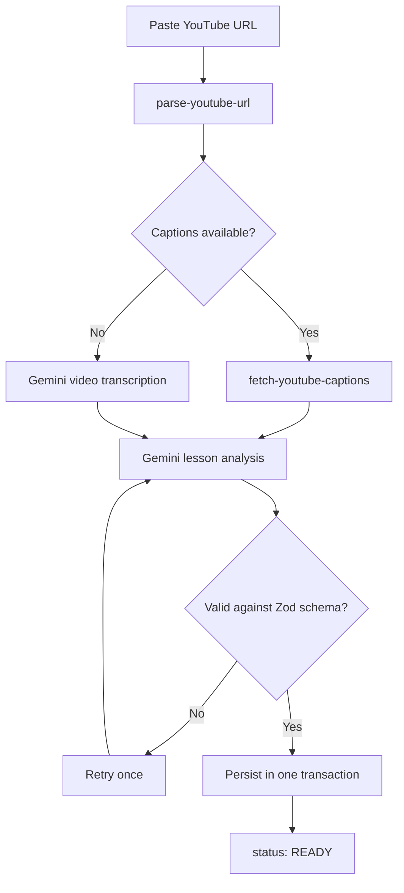

# English AI Summary

Turn any YouTube video into a structured English lesson — transcript, vocabulary, grammar notes, a quiz, and a practice dialogue — then drill the vocabulary with spaced-repetition flashcards.

Paste a link, wait for the AI pass, and you get an ELLLO-style lesson backed by the original video with click-to-seek playback.

<p>
  
  
  
  
  
  
</p>

---

## Features

**Lesson generation**
- Paste a YouTube URL — the app fetches captions, or falls back to Gemini video transcription when the video has none
- Every lesson is generated once per user and reused on repeat submissions (idempotent per `userId + videoId`)
- Lesson density is tunable in the submit form — see the table below

**Five lesson tabs**

| Tab | What you get | Configurable |
|---|---|---|
| **Script** | Timestamped transcript — click any line to seek the embedded player | — |
| **Vocabulary** | Terms with meanings and example sentences; save any item to your flashcard deck | 5 / 10 / 15 / 20 / 25 items *(default 10)* |
| **Grammar** | Points built around the video's single dominant structure, each with exactly 4 *invented* examples — never quoted from the video | 4 / 6 / 8 points *(default 4)* |
| **Quiz** | Gap-fill questions, exactly 3 options each | 5 / 10 / 15 / 20 questions *(default 5)* |
| **Dialogue** | An AI-written practice conversation aligned to the video's context | 10–50 turns *(default 20)* |

**Spaced repetition**
- Vocabulary saved to your deck becomes an FSRS flashcard ([`ts-fsrs`](https://github.com/open-spaced-repetition/ts-fsrs))
- `/review` serves the due queue; grade with Again / Hard / Good / Easy
- Every grade writes a `ReviewLog`, so scheduling history is auditable

---

## How it works



Generation runs as a **two-call strategy** — one call to produce the transcript, a second to analyse it. A single-call variant exists in the codebase but is disabled: passing video input together with a JSON response schema was rejected by the API during a probe on 2026-07-25 (see `GEMINI_SUPPORTS_VIDEO_WITH_SCHEMA` in `src/lib/gemini/generate-lesson.ts`).

Failures are caught, sanitised into a user-safe message, and stored on the lesson row as `status: FAILED` with `errorMessage` — private videos and playlist links get their own explanations rather than a generic error.

---

## Tech stack

| Layer | Choice |
|---|---|
| Framework | Next.js 16 (App Router, Server Actions) |
| UI | React 19, Tailwind CSS 4, shadcn/ui, Base UI, lucide-react |
| AI | Google Gemini via `@google/genai`, structured output validated with Zod |
| Data | PostgreSQL + Prisma 6 |
| Scheduling | `ts-fsrs` 5 |
| Testing | Vitest (unit + integration against a real test database) |
| Deploy | Docker / Docker Compose, Dokploy-ready |

---

## Getting started

### Prerequisites

- Node.js 20+ and [pnpm](https://pnpm.io) — the Docker image builds on Node 24
- A PostgreSQL instance
- A Gemini API key — [aistudio.google.com/apikey](https://aistudio.google.com/apikey)

### Setup

```bash
git clone git@github.com:nhonhoatran/english-ai-summary.git
cd english-ai-summary
pnpm install
cp .env.example .env
```

Fill in `.env`:

| Variable | Required | Notes |
|---|:---:|---|
| `GEMINI_API_KEY` | ✅ | From Google AI Studio |
| `DATABASE_URL` | ✅ | Postgres connection string |
| `AUTH_SECRET` | ✅ | Min 32 chars — `openssl rand -hex 32` |
| `APP_PASSWORD` | ✅ | Min 8 chars. Validated at boot but not currently read by the login route — see [Authentication](#authentication) |
| `GEMINI_MODEL` | — | Defaults to `gemini-3.6-flash` |
| `TEST_DATABASE_URL` | — | Separate database for integration tests |

Then apply migrations and start:

```bash
pnpm prisma migrate dev
pnpm dev
```

Open [http://localhost:3000](http://localhost:3000).

### Authentication

Access is gated by middleware on every route except `/login` and `/api/login`. Signing in takes a **phone number**, which upserts a `User` record and issues a signed, `httpOnly` session cookie — there is no password check and no verification step, so treat this as a single-tenant convenience gate rather than real authentication.

`APP_PASSWORD` is still enforced by the environment schema in `src/lib/env.ts`, so the app will refuse to boot without it even though the login route ignores it. `src/lib/auth/verify-password.ts` exists but is currently unreferenced.

---

## Scripts

| Command | Does |
|---|---|
| `pnpm dev` | Development server |
| `pnpm build` | Production build |
| `pnpm start` | Serve the production build |
| `pnpm lint` | ESLint |
| `pnpm typecheck` | `tsc --noEmit` |
| `pnpm test` | Run the Vitest suite once |
| `pnpm test:watch` | Vitest in watch mode |
| `pnpm probe:gemini` | Probe whether Gemini accepts video input with a JSON schema |

---

## Testing

Unit tests live beside the code they cover (`*.test.ts`); integration tests live in `tests/integration/` and run against a **real** database defined by `TEST_DATABASE_URL`, reset between runs by `tests/helpers/reset-test-database.ts`.

```bash
pnpm test
```

See [`docs/testing.md`](docs/testing.md) for the full setup.

---

## Project structure

```
src/
├── app/
│   ├── actions/          Server Actions — ingest, delete, grade, save-vocab
│   ├── api/              login / logout route handlers
│   ├── lessons/[id]/     Lesson detail page
│   ├── review/           Flashcard review session
│   └── login/
├── components/
│   ├── lesson/           Player provider, tabs, list card
│   ├── review/           Review session, grade buttons
│   └── ui/               shadcn/ui primitives
├── lib/
│   ├── auth/             Session cookie signing, route guard
│   ├── fsrs/             Card creation, grading, ts-fsrs instance
│   ├── gemini/           Client, prompts, schemas, generation strategies
│   └── ingest/           URL parsing, caption fetching, orchestration
└── middleware.ts         Auth gate

prisma/                   Schema and migrations
tests/                    Integration tests, fixtures, helpers
docs/                     Deployment and testing guides
```

---

## Data model

`Lesson` is the aggregate root. `TranscriptSegment`, `DialogueLine`, `GrammarPoint`, `QuizQuestion`, and `VocabItem` all cascade from it, so deleting a lesson cleans up everything it produced.

Flashcards are deliberately **not** cascaded from lessons — they hang off `User` and `VocabItem`, uniquely keyed on `(userId, vocabItemId)`. `Flashcard` mirrors the `ts-fsrs` card fields verbatim, and `ReviewLog` records every grade for audit.

Full schema: [`prisma/schema.prisma`](prisma/schema.prisma).

---

## Deployment

Ships with a `Dockerfile` and `docker-compose.yml`:

```bash
docker compose up -d --build
```

If Postgres runs on the VPS host rather than in Docker, point `DATABASE_URL` at `host.docker.internal` — the compose file already maps it via `extra_hosts`.

Full Dokploy and VPS walkthrough: [`docs/deployment.md`](docs/deployment.md).

---

## Notes and known gaps

- **Database changes must go through migrations.** Use `prisma migrate dev`; never `prisma db push`, which desynchronises the live schema from the tracked migration history.
- Single-call Gemini generation is written but disabled — re-run `pnpm probe:gemini` if you want to recheck whether the API now supports it.
- The per-section counts above are enforced by the prompt, not by the schema: `lesson-schemas.ts` only requires each array to be non-empty, so a model that under-delivers still validates. The `length(4)` on grammar examples and `length(3)` on quiz options *are* hard-enforced.
- The login flow accepts any phone number without verification (see [Authentication](#authentication)).
